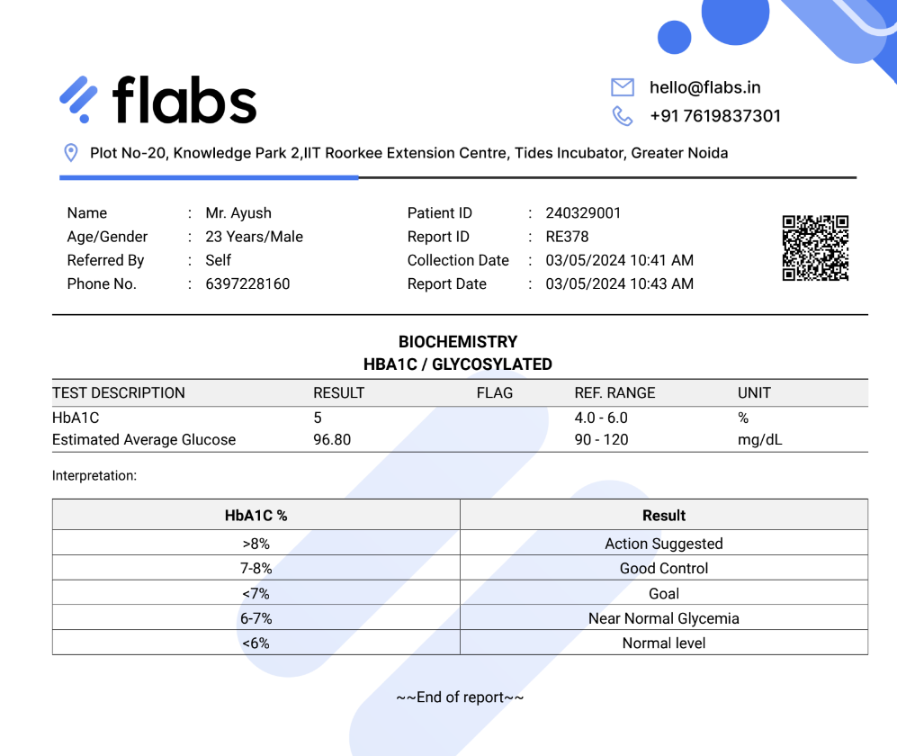
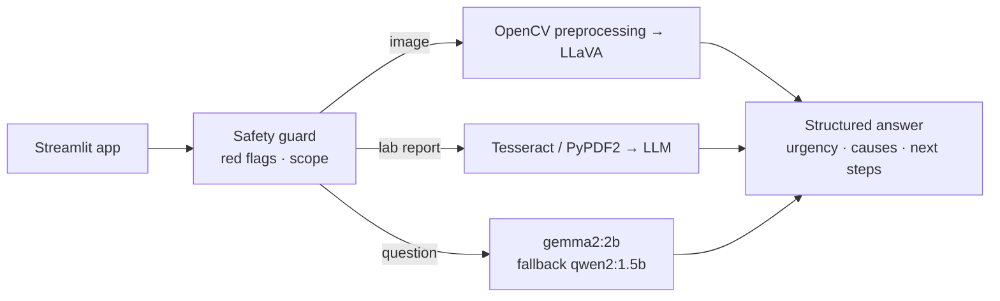

# MediLens

**A medical triage assistant that runs entirely on your laptop. No patient data leaves the machine.**

MediLens reads a photo of a wound, rash or burn, or a scanned lab report, and returns a structured answer: what it likely is, how urgent it is, what to do now, and when to see a doctor. Everything runs through local models in Ollama, so it works offline and nothing is sent to a cloud API.

I built it to see how far small open models can go on clinical triage when privacy rules out sending data anywhere.



## What it does

| Feature | How it works | Where in the code |
|---|---|---|
| Image triage | LLaVA (`llava:7b`) reviews the image after OpenCV preprocessing and returns an urgency level, likely causes and next steps as structured output | `services/vision_service.py` |
| Lab report reading | Tesseract OCR and PyPDF2 extract text from photos and PDFs, then the LLM flags abnormal values in plain language | `services/document_service.py` |
| Symptom chat | `gemma2:2b` answers with likely causes, immediate steps and escalation criteria, with `qwen2:1.5b` as an automatic fallback | `services/chat_service.py`, `config.py` |
| Red-flag guard | Pattern checks catch emergencies (chest pain, stroke signs, heavy bleeding and more) and override the model with an emergency message | `services/safety_guard.py` |
| Scope check | Non-medical questions are declined, and every response is validated before it is shown | `services/safety_guard.py` |

## Results

- 75% urgency-triage accuracy on 100+ clinical images and lab reports.
- About 20 tokens/s on a laptop CPU, fully offline.

## How it fits together


```mermaid
flowchart LR
    U["Streamlit app"] --> G["Safety guard<br/>red flags · scope"]
    G -->|image| V["OpenCV preprocessing → LLaVA"]
    G -->|lab report| D["Tesseract / PyPDF2 → LLM"]
    G -->|question| C["gemma2:2b<br/>fallback qwen2:1.5b"]
    V --> S["Structured answer<br/>urgency · causes · next steps"]
    D --> S
    C --> S
```

## Quick start

Requirements: Python 3.8+, Ollama, 8 GB RAM (16 GB for the vision model). Tesseract is optional but improves lab-report reading.

```bash
# 1. Install Ollama: https://ollama.com/download
ollama pull gemma2:2b
ollama pull qwen2:1.5b
ollama pull llava:7b      # for image triage

# 2. Clone and install
git clone https://github.com/TashonBraganca/Medicio-Ai.git
cd Medicio-Ai
pip install -r requirements.txt

# 3. Optional OCR
brew install tesseract           # macOS
sudo apt-get install tesseract-ocr   # Linux

# 4. Run
streamlit run app.py
```

Open `http://localhost:8501`.

Models, thresholds and prompts are set in `config.py`.

## Project layout

```
app.py              Streamlit UI and flow
config.py           models, prompts, thresholds
services/
  chat_service.py      chat and response formatting
  vision_service.py    image preprocessing and LLaVA analysis
  document_service.py  OCR and PDF parsing
  safety_guard.py      red-flag detection and scope checks
  medical_safety.py, clinical_validation.py, legal_compliance.py   response checks
```

## Limits

MediLens is a research and learning project, not a medical device. It can be wrong. Always go to a doctor or emergency services for anything serious.

Built by [Tashon Braganca](https://github.com/TashonBraganca).
